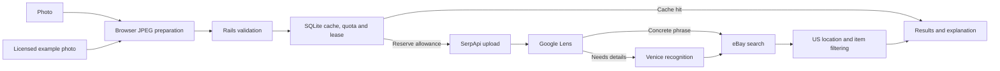

# LooksAlike

A furniture photo search demo built with Rails, React, and Material UI. The flow is photo upload → Google Lens → a short search phrase → US-located eBay listings, with Venice photo recognition when Lens lacks concrete details. It needs no ZIP code. The screen consumes streamed progress, shows eBay cards and restores a valid current-tab result without making new calls. Live search defaults to disabled.

The [September 29 v6 comparison](docs/experiments/ebay-flow-v6/README.md) passed four of five fixed photos: modern sofa, dining chair, coffee table and dresser. The ornate sofa failed when Venice exceeded its 15-second limit, so its eBay search did not run. Measured full-flow times ranged from [5.032 seconds](docs/experiments/ebay-flow-v6/modern-sofa.json) to [33.788 seconds](docs/experiments/ebay-flow-v6/dining-chair.json). Each passing case had at least three relevant, distinct, accessible US-located listings among its original first six. Many matches share only some shape, material or style; this fixed sample does not establish general visual accuracy or current listing availability.

Choosing the example prepares a bundled licensed green-sofa photo. Find similar items submits it through the same live search, cache and limits as an upload, with actual server progress. It does not replay historical results. The [runtime example notes](docs/examples/runtime-example.md) describe the photo license and saved-view boundary. The source is public on [GitHub](https://github.com/nodatall/looksalike/tree/deliver/looksalike-demo). Try the [live demo](https://web-production-1e238.up.railway.app/). [Hosted verification](docs/deployment.md) covers storage persistence, a 34-second streamed response, the 55-second deadline and a real new-photo search with Venice.

## Architecture and limits



Rails streams real progress to the React screen. A fresh completed search uses one upload and two SerpApi search attempts: Lens and eBay. An optional Venice call reserves $0.03 conservatively before dispatch. These are allowance reservations, not verified billed costs; failed work remains counted. Cache hits make zero new provider calls. The example uses the same cache policy as any other photo and needs the same provider calls on a cache miss.

Default ceilings are 10 SerpApi units per UTC day and 180 per rolling 30 days, with two units reserved for each fresh search. Each session and IP allows three fresh searches per hour. Venice has separate ceilings of five calls daily and 90 per rolling 30 days. Positive configuration may lower these limits. A single live-search lease prevents concurrent paid flows. Successful results cache for 24 hours; empty results for one hour. The server deadline is 55 seconds, including at most 15 seconds for Venice; the browser aborts after 65 seconds. See [architecture](docs/ARCHITECTURE.md) for the persistence and response contracts.

## Local setup

Use Ruby 3.4.10, Node 22.22.3, and libvips. On Apple Silicon macOS:

```sh
brew install ruby@3.4 vips
export PATH="/opt/homebrew/opt/ruby@3.4/bin:$PATH"
```

Check `ruby --version` and `node --version` against `.ruby-version` and `.node-version`. Use your Node version manager to select the pinned Node version.

Then install and prepare the app:

```sh
bin/setup --skip-server
bin/dev
```

Open [localhost:3000](http://localhost:3000). The health check is `/up`. `bin/setup` installs dependencies, builds JavaScript, prepares SQLite, and starts Rails.

During frontend development, run `npm run build -- --watch` in another terminal and reload the page after changes. Rails remains the only web server.

Development and test load environment configuration through `dotenv-rails`. Copy `.env.example` to `.env.local` only if you do not already have that local file, and keep any key there. Set `SERPAPI_API_KEY` for Lens/eBay and `VENICE_API_KEY` for the optional photo fallback. Never put either key in browser code or commit it. Normal checks do not need a key. `.env.example` lists the enforced search ceilings; configuration may lower them. Development/test SQLite databases live under `storage/`. Production reads configuration from the host environment.

## Production container and Railway

`Dockerfile` pins Ruby 3.4.10 and Node 22.22.3, installs libvips, installs locked dependencies and precompiles the React/Propshaft assets without provider credentials. Node and build tools stay in the build stage. The runtime serves assets through Rails and starts Puma directly, in one process with three request threads by default. Production rejects `RAILS_MAX_THREADS` below three; `WEB_CONCURRENCY` does not enable extra workers. Secrets, local databases, Git data, tasks, scratch work and historical experiment media are excluded from the build context.

Build locally with `docker build -t looksalike:local .`. Before running, supply `SECRET_KEY_BASE` through your runtime secret manager. Do not use `SECRET_KEY_BASE_DUMMY` for a running service. Keep `LIVE_SEARCH_ENABLED=false` while validating startup. For a local lifecycle check with a named volume:

```sh
docker volume create looksalike-storage
docker run --rm -p 3000:3000 \
  -e SECRET_KEY_BASE -e LIVE_SEARCH_ENABLED=false \
  -e RAILWAY_VOLUME_MOUNT_PATH=/app/storage \
  -v looksalike-storage:/app/storage looksalike:local
```

The command passes an already configured `SECRET_KEY_BASE` from your environment without embedding its value. Production assumes HTTPS terminates at the host proxy; `/up` accepts HTTP for health checks.

On Railway, attach a persistent volume at `/app/storage`, configure `SECRET_KEY_BASE`, and keep one service instance. Railway supplies `RAILWAY_VOLUME_MOUNT_PATH` for the attached volume. `railway.json` configures the Dockerfile build, one replica and `/up` health checks. Leave `DATABASE_URL` unset; the only permitted explicit value is `sqlite3:/app/storage/production.sqlite3`. Alternate URL forms, query parameters and external databases fail closed. These settings follow the [Railway configuration reference](https://docs.railway.com/config-as-code/reference) and [volume reference](https://docs.railway.com/volumes/reference).

Startup verifies an actual Linux mount at `/app/storage` before changing its ownership, then drops to the `rails` user. It checks the resolved Rails adapter/path, the environment URL and real write access before `db:prepare`. SQLite, WAL/SHM and journal files stay on the mount; database symlinks are rejected. Repeated preparation preserves existing lease ownership and allowance rows. A missing, wrong or unusable mount skips preparation and disables live search while the upload page, example-photo selection and `/up` remain available. Submitting the example follows the same unavailable-search outcome as an upload. No replacement database is created in the container filesystem. `SearchStore` repeats this guard before checking out any cache/allowance connection. `/up` confirms the web process is responsive; it does not certify storage or provider readiness.

Only enable live search after checking persistence across restarts, successful mounted database preparation, valid limits and both provider keys. Container checks and hosted Railway timing/persistence evidence are separate; adding these files does not establish a deployment.

## Browser assets

`app/javascript/application.jsx` mounts one React root in the ERB page. The shared Material UI theme lives in `app/javascript/search/theme.js`. The app uses local system fonts and bundled dependencies; it needs no CDN requests.

`npm run build` uses esbuild to write `app/assets/builds/application.js`. Rails `assets:precompile` automatically installs the locked npm dependencies and runs this build through `jsbundling-rails`, then Propshaft fingerprints the assets for production. Keep Node and npm available during the deployment build, including esbuild's development dependency.

To verify production asset compilation without real credentials:

```sh
RAILS_ENV=production SECRET_KEY_BASE_DUMMY=1 bin/rails assets:precompile
```

Run `bin/rails assets:clobber` and `npm run build` before returning to local development so the production manifest does not hide later rebuilds.

The screen mockup and execution plan remain under `tasks/`. The standalone mockup imports shared app components and explicitly enables historical example replay in its own session-storage namespace. Uploaded photos never receive those historical results. The production app never imports `tasks/` and accepts only live or cached results.

## Troubleshooting

JSON 3.0.2 rejects the positional options passed by Rails 8.1.3.1 in `ActiveSupport::JSON.decode`. A fresh page worked, but a repeat load with its session cookie failed while rendering CSRF metadata. The Gemfile constrains JSON to the compatible 2.x series; `test/integration/home_test.rb` covers both requests with the same cookie.

An eBay request with `_salic=1` failed twice after about 90 seconds; removing only that country filter returned 60 listings in 2.12 seconds in the [isolated diagnostic](docs/experiments/ebay-no-country-v1/README.md). The filter is a suspected cause, not a proven provider diagnosis. The app omits country, ZIP and pickup parameters and accepts only rows explicitly marked `Located in United States`. A timeout or provider failure does not establish that matching inventory is absent; see the [country-filter failure evidence](docs/experiments/ebay-us-retry-v1/README.md).

## Checks

Run `bin/check` before committing. It runs Ruby style checks, Biome formatting/lint checks, Ruby and npm dependency audits, the locked Brakeman scanner, the JavaScript build, test database preparation, Rails eager loading, and Minitest. The command uses the test environment, disables live search, and clears both provider keys for child commands. Advisory checks need public internet access; they make no paid provider calls.

For focused work:

```sh
bin/rubocop                 # Ruby style
bin/rubocop -a              # Apply safe Ruby style fixes
npm run check              # JavaScript lint and formatting check
npm run format             # Format owned JavaScript/config files
npm run build              # Build before focused request tests
bin/rails test test/integration/home_test.rb
```

The formatting tools exclude the historical mockup, generated assets, dependencies, and private working directories. JavaScript stays JSX without a TypeScript check. GitHub Actions runs the same `bin/check` on pushes and pull requests with Ruby 3.4.10, the pinned Node 22 version, and libvips. No Git hooks are installed.

## Photo and provider boundary

The page uses `app/javascript/search/preparePhoto.js` to check JPEG/PNG/WebP headers before decoding, reject sources over 10 MB or 20 megapixels and animated PNG/WebP, and produce a JPEG of at most 450,000 bytes. The versioned `jpeg-v1` recipe starts at a 1,600-pixel longest edge with fixed quality and resize steps, applies image orientation, and flattens transparency onto white. The preview uses only the prepared image. Replacing it releases the old object URL; canceled work releases its decoded bitmap. Submitting sends only the prepared JPEG to the Rails search route.

The manual fixture tool executes that exact browser module in installed Chrome, blocks external requests, and writes prepared JPEGs plus recipe/dimension/hash/browser metadata without overwriting existing files:

```sh
npm run prepare:photos -- /tmp/prepared-photos /absolute/path/to/photo.jpg
```

JPEG bytes may differ across browser encoder versions. Freeze the produced bytes and recorded browser metadata for an experiment; the recipe alone does not promise byte-identical output across machines. This preparation command does not establish provenance or score search results.

Puma rejects the complete request body above 600,000 bytes before Rails buffering. `PhotoValidator.call(upload, deadline:)` independently checks image magic, the 450,000-byte photo limit, dimensions, animation, and complete decoding with libvips. It ignores claimed filenames/MIME and consumes/deletes uploaded Tempfiles on success or failure. It creates no persistent image storage.

`SerpApi::Client` owns fixed HTTPS upload, Lens, Images and eBay requests. Upload validates bytes before dispatch. Pass the **same** `SearchDeadline` to preparation and every provider call; its default is 55 seconds measured monotonically, with remaining socket timeouts and one shared timer for nested work. Responses are limited to 2 MB. There are no retries, redirects or polling. Public errors and object string representations omit sensitive content; Rails filters photo/image/key/reference parameters. The public route reserves allowance and a single live-search lease in SQLite before dispatch; the separate manual experiment ledger preserves historical attempt accounting.

Normal Ruby tests use WebMock with all external network access disabled. `npm test` exercises header, limit, compression-cap, cleanup, and cancellation rules. `bin/check` runs both JavaScript and Ruby tests. The fixture tool and manual UI probe additionally verify real browser encoding; fixture preparation makes no SerpApi calls.

`EbayQueryPreparation` keeps a Lens phrase with a recognized color or material, or requests one photo description through `Vision::Client`. Style-only phrases such as “vintage sofa” use Venice. It carries the recognized category separately from the search phrase. `EbayListingFilter` removes wrong furniture types, accessories and miniatures from eligible eBay rows before the caller takes six; sponsored items use the same rules. The filter preserves order and reports rejection reasons. Title filtering does not establish visual similarity. `PhotoQuery` checks the structured description before making a phrase. The vision client uses a fixed Venice model, sends only a validated reduced JPEG, requires an attempt-reservation callback, and has no retries. It receives at most 15 seconds while preserving 10 seconds for the eBay request. These boundaries are tested with network stubs and the completed live comparison. Public-route and manual-ledger vision reservations both happen before dispatch.

## Historical research

Earlier reports preserve their original requests, policies, attempt ledgers and judgments: [Craigslist feasibility](docs/experiments/feasibility-v1/README.md), [query comparison](docs/experiments/query-v2/README.md), [diagnostic](docs/experiments/diagnostic-v1/README.md), [Venice v3 comparison](docs/experiments/ebay-flow-v3/README.md), [ornate-sofa v4 retest](docs/experiments/ebay-flow-v4/README.md) and [v5 comparison](docs/experiments/ebay-flow-v5/README.md). The current eBay quality evidence is the v6 comparison linked above.

The [manual operator instructions](docs/experiments/feasibility-v1/README.md#manual-operator-commands) describe explicit account checks, execution and scoring. The historical v1 verifier applies to Git revision `79e05a3`; it intentionally refuses revised query policies. Default preflight is offline and creates no ledger. Research scores, local application/container checks and hosted deployment evidence remain separate.
